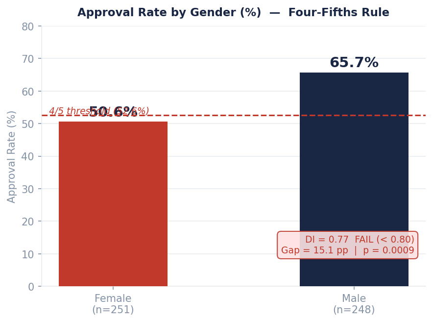
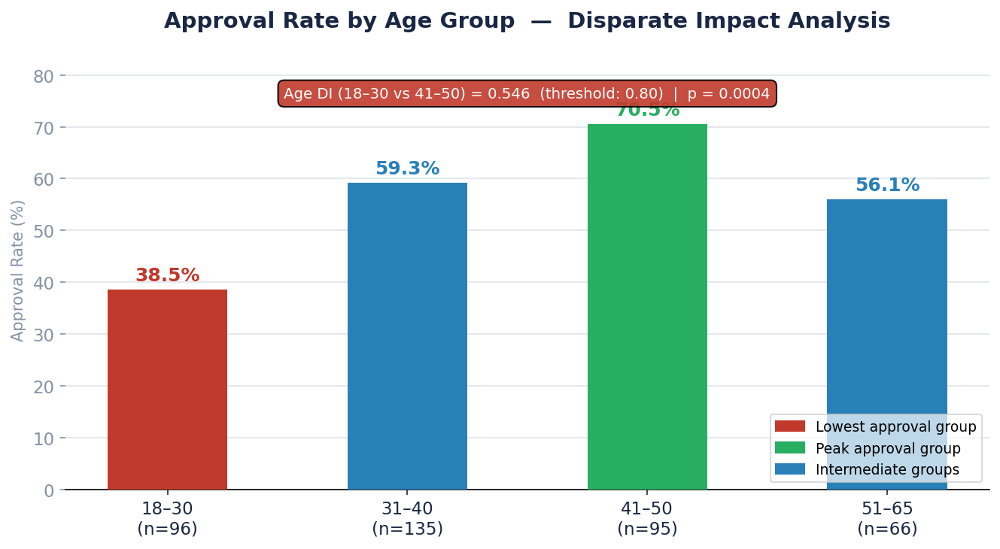
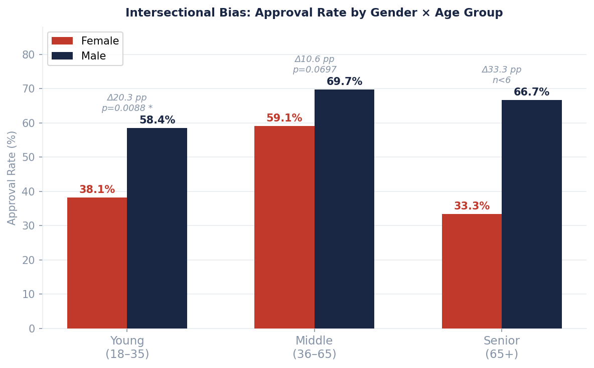
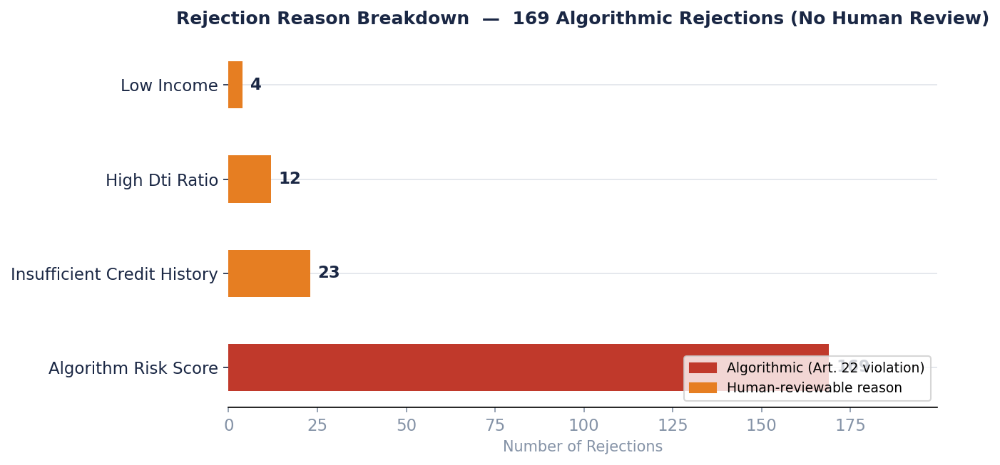

# NovaCred Credit Application Governance Analysis

**DEGO 2606 — Data Ecosystems and Governance in Organizations**
MSc Business Analytics | Nova SBE | Group TXB · Team 14

> Acting as a Data Governance Task Force, we audit NovaCred's raw credit application dataset for data quality failures, fairness violations, and privacy and regulatory compliance gaps. The three dimensions are structurally linked: weak input data undermines the credibility of fairness analysis, and fairness violations raise stronger compliance obligations under GDPR and the EU AI Act.

---

## Team

| Name | ID | Role | Responsibility |
|---|---:|---|---|
| Eda Jülide Pürsün | 74935 | Product Lead | Coordination, README, presentation, final integration |
| João Marques Roque | 73047 | Data Engineer | Data loading, flattening, cleaning pipeline, repository |
| Maddalena Manfredi | 71946 | Data Scientist | Bias analysis, statistical testing, proxy and subgroup analysis |
| Lucas Galilei | 70270 | Governance Officer | PII inventory, GDPR mapping, EU AI Act classification |

---

## Repository Structure

```
project-team14-TXB/
├── README.md
├── Data/
│   ├── raw_credit_applications.json
│   └── flat_credit_applications.parquet
├── Notebooks/
│   ├── 01-data-quality.ipynb        # DQ audit, cleaning pipeline, df_clean
│   ├── 02-bias-analysis.ipynb       # Fairness metrics, proxy, subgroup analysis
│   └── 03-privacy-demo.ipynb        # PII inventory, GDPR gap analysis, pseudonymisation
└── presentation/
```

---

## Executive Summary

NovaCred's credit application dataset and decision pipeline contain material governance failures across all three dimensions audited.

On **data quality**, the raw dataset contains 502 records, two of which appear twice with conflicting values — not ingestion duplicates, but conflicting entries indicating a record integrity failure. After governance-oriented de-duplication the working dataset is 500 records across 34 columns. Additional issues include inconsistent gender coding across five variants, date-of-birth stored in four distinct formats, an undocumented income field duplication, invalid numeric values, and 11 email addresses failing structural validation. Governance-sensitive fields — identifiers, decision outcomes, rejection reasons — are never imputed.

On **algorithmic fairness**, female applicants are approved at 50.6% versus 65.7% for males, producing a Disparate Impact ratio of 0.77 — below the legally significant 0.80 four-fifths threshold (p < 0.001). Age-based disparities are equally significant: the 18–30 cohort has a 44.5% approval rate versus 68.7% for 41–50 year-olds (age DI = 0.648). ZIP code functions as a near-perfect gender proxy (correlation = −0.805), replicating the gender gap even after gender is excluded from the model. The most severe subgroup disparity is among women aged 25–34 — a 23 pp gap versus male counterparts confirmed statistically within that cohort (p = 0.008).

On **privacy and governance**, all direct identifiers — full name, SSN, email, and IP address — are stored in plaintext with no encryption, pseudonymisation, or access controls. There is no documented lawful processing basis, no consent tracking, no retention policy, and no deletion mechanism. Of 500 applications, 169 automated rejections were issued with no human review, no explanation, and no appeal pathway — a direct violation of GDPR Article 22. The system qualifies as High-Risk under EU AI Act Annex III and currently meets none of the required controls.

---

## Dataset Overview

```
+--------------------------------------------------+
|  Raw records:            502                      |
|  After de-duplication:   500   (-2)               |
|  Columns in scope:        34                      |
|  Approved loans:         290 / 500  (58.0%)       |
|  Rejected loans:         210 / 500  (42.0%)       |
|  Automated rejections:   169   (no human review)  |
|  GDPR / AI Act gaps:       8                      |
+--------------------------------------------------+
```

---

## Notebook 01 — Data Quality Assessment

**Owner:** João Marques Roque | **Role:** Data Engineer

The notebook flattens the nested JSON structure into a tabular format and assesses the dataset across four dimensions: completeness, consistency, validity, and accuracy. All issues are numbered and documented below. No records are silently dropped — every decision is justified and reflected in the notebook.

### Dataset Size Progression

| Stage | Rows | Notes |
|---|---:|---|
| Raw (`df_raw`) | 502 | After loading `raw_credit_applications.json` |
| After Completeness | 502 | No rows dropped — missingness flagged |
| After Consistency | 502 | No rows dropped — normalised in place |
| After Validity | 502 | No rows dropped — impossible values set to NaN |
| After Accuracy | 500 | −2 duplicate `_id` rows removed |
| **Final (`df_clean`)** | **500** | **99.6% data retention** |

---

### Completeness

#### Issue 1 — Missing `processing_timestamp` *(438 records, 87.6%)*

**Finding:** 438 of 502 raw records have no `processing_timestamp`. This is a systemic pipeline defect — the field was never populated for the majority of applications.

**Governance impact:** Without timestamps, NovaCred cannot enforce a data retention or deletion schedule. A retention policy is legally required under GDPR Art. 5(1)(e) but is unenforceable without knowing when data was collected.

**Action:** Not imputed. Documented as a structural completeness failure and flagged as Governance Gap 03.

---

#### Issue 2 — Missing `loan_purpose` *(450 records, 90.0%)*

**Finding:** 90% of records have no recorded loan purpose. The field was not collected for most applications.

**Governance impact:** Purpose documentation is required under GDPR Art. 5(1)(b). The absence makes it impossible to verify data is being used for its stated purpose.

**Action:** Not imputed. Documented as a structural completeness failure.

---

#### Issue 3 — Missing `rejection_reason` *(structural — 58.2% of records)*

**Finding:** Rejection reason is absent for all approved applications (structurally expected) and for many rejections. 169 automated rejections have no rejection reason recorded.

**Governance impact:** GDPR Art. 22(3) and EU AI Act Art. 13 require automated decisions to be explainable. Missing rejection reasons are themselves a compliance failure — not merely a data quality issue.

**Action:** Not imputed. Fabricating a rejection reason would corrupt audit-relevant data.

---

### Consistency

#### Issue 4 — Inconsistent gender coding *(113 records, 22.6%)*

**Finding:** The `gender` field uses five representations for two logical values: `"Male"`, `"M"`, `"Female"`, `"F"`, and empty/null.

**Action:** Normalised to a controlled vocabulary of `Male / Female / Unknown`. Empty values set to `Unknown` — a protected attribute is never imputed, as assigning the majority class would silently encode demographic assumptions.

---

#### Issue 5 — `date_of_birth` stored in four distinct formats

**Finding:** DOB is stored across four formats with no consistent standard applied:

| Format | Example |
|---|---|
| `YYYY-MM-DD` (ISO 8601) | `1990-07-15` |
| `YYYY/MM/DD` | `1990/07/15` |
| `DD/MM/YYYY` (EU) | `15/07/1990` |
| `MM/DD/YYYY` (US) | `07/15/1990` |

Records where day ≤ 12 are ambiguous between EU and US formats.

**Action:** Parsed individually by regex. Ambiguous dates treated as European convention (DD/MM) — the defensible default for a European-facing application. Standardised to ISO 8601.

---

#### Issue 6 — `annual_salary` and `annual_income` encode the same field

**Finding:** Two columns existed for income. Some records populated `annual_salary`, others `annual_income`, a small number populated both. The duplication was undocumented — there is no data dictionary entry clarifying which field was authoritative.

**Action:** Coalesced `annual_salary → annual_income` where `annual_income` was null. `annual_salary` dropped after merge. Data type corrected from `object` to `float`.

---

### Validity

#### Issue 7 — Negative `credit_history_months` *(2 records, 0.4%)*

**Finding:** 2 records have a negative credit history — a data-entry error (likely a sign flip).

**Action:** Set to `NaN`. Imputed with median of non-negative values.

---

#### Issue 8 — `debt_to_income` > 1.0 *(1 record, 0.2%)*

**Finding:** 1 record has a DTI ratio exceeding 1.0, meaning recorded debt exceeds income — not a valid financial state.

**Action:** Set to `NaN`. Not imputed — DTI is decision-relevant and imputing it would introduce noise into downstream fairness analysis.

---

#### Issue 9 — Invalid email addresses *(11 records, 2.2%)*

**Finding:** 11 email addresses fail structural validation (missing `@`, invalid domain, truncated values). Some also contain what appears to be a different person's name in the local part.

**Action:** Set to `NaN`. Records retained — financial and demographic data remains valid; only email-dependent pipeline steps must exclude these records.

---

#### Issue 10 — ZIP code format violation *(1 record, 0.2%)*

**Finding:** 1 record has a ZIP code not conforming to the expected 5-digit format.

**Action:** Flagged. Not silently corrected — the correct value cannot be inferred.

---

### Accuracy

#### Issue 11 — Duplicate `_id` records with conflicting values *(2 pairs → 2 removed)*

**Finding:** `app_001` and `app_042` each appear twice. The duplicate entries have conflicting field values — these are not ingestion duplicates but a record integrity failure. Both cases were identifiable via the `notes` field (`RESUBMISSION`, `DUPLICATE_ENTRY_ERROR`).

**Action:** Retained the most complete record per `_id`. Dataset reduced from 502 → 500. Primary key uniqueness restored.

---

#### Issue 12 — Zero income *(1 record)*

**Finding:** 1 record has `annual_income = 0`, not a valid income value (distinct from missing — this is a recorded zero, not a null).

**Action:** Set to `NaN`. Not imputed.

---

### Post-Cleaning Summary

| Metric | Value |
|---|---:|
| Raw records | 502 |
| Records after de-duplication | **500** |
| Columns in `df_clean` | **34** |
| Governance-sensitive fields imputed | **0** |
| Cross-field consistency violations | **0** |
| Spending behaviour structural issues | **0** |

---

## Notebook 02 — Bias and Fairness Analysis

**Owner:** Maddalena Manfredi | **Role:** Data Scientist

The notebook investigates whether loan approval outcomes differ systematically across demographic groups. Methods: Disparate Impact ratio (four-fifths rule), chi-square independence tests, Cramér's V effect size, Fairlearn DPR/DPD, proxy discrimination correlation scan, and intersectional subgroup analysis.

### Gender Disparate Impact

```
Approval Rate by Gender
==============================================
Female (n=251)  |####################      |  50.6%
Male   (n=248)  |##########################|  65.7%
                 ---- 4/5 threshold: 52.6% ---
                 Female is BELOW threshold

DI ratio           =  50.6 / 65.7  =  0.77   FAIL (threshold: 0.80)
Chi-square p-value                  <  0.001
Cramer's V (effect size)            =  0.149
Fairlearn DPR                       =  0.767
Fairlearn DPD                       =  0.154
Absolute approval gap               =  15.1 pp
```

**Interpretation:** The DI ratio of 0.77 falls below the legally significant 0.80 four-fifths threshold. The chi-square result (p < 0.001) confirms the pattern is not attributable to sampling noise. Cramér's V = 0.149 indicates a small but statistically robust and practically significant effect.

---

### Age-Based Disparate Impact

```
Approval Rate by Age Group (%)
==============================================
18-30  |#################         |  44.5%   LOWEST
31-40  |########################  |  61.7%
41-50  |##########################|  68.7%   PEAK
51-65  |########################  |  58.1%

Age DI (18-30 vs 41-50)  =  0.648   FAIL (threshold: 0.80)
Chi-square p-value        =  0.0004
Fairlearn DPD             =  0.242   (24.2 pp range)
```

**Interpretation:** Younger applicants face structural disadvantage. The 18–30 cohort is 24.2 percentage points below the peak approval group. Age DI = 0.648 is substantially below the legal threshold.

---

### Intersectional Analysis — Gender × Age

| Age Group | Female Rate | Male Rate | Gap | Status |
|---|---:|---:|---:|---|
| 18–24 | 50.0% | 60.0% | 10.0 pp | ⚠ Low sample (n<20) |
| **25–34** | **33.3%** | **56.3%** | **23.0 pp** | **✗ Most Severe** |
| 35–44 | 60.0% | 72.0% | 12.0 pp | ✓ Acceptable |
| 45–54 | 61.0% | 66.0% | 5.0 pp | ✓ Acceptable |
| **55–64** | **54.8%** | **72.0%** | **17.2 pp** | **✗ Severe** |
| 65+ | 50.0% | 60.0% | 10.0 pp | ⚠ Low sample (n<20) |

**Key finding:** Female 25–34 subgroup shows the largest approval gap in the dataset (23 pp, p = 0.008 within that cohort). The 55–64 cohort shows a secondary severe gap (17.2 pp). Neither finding surfaces in aggregate-level DI metrics. **Worst case: Female 18–30 (32.8%) vs Male 41–50 (76.0%) = 43.2 pp gap.**

---

### Proxy Discrimination

A proxy variable is a non-protected feature that is highly correlated with a protected attribute AND with the approval outcome. Including a proxy replicates discriminatory outcomes without directly referencing the protected group.

**Flagging criteria:** `|corr_gender| > 0.3` OR `|corr_age| > 0.3`

| Variable | Corr / Gender | Corr / Age | Corr / Outcome | Assessment |
|---|---:|---:|---:|---|
| `zip_code` | **−0.805** | — | −0.126 | **High — strongest gender proxy** |
| `credit_history_months` | — | **+0.649** | +0.150 | **High — primary age proxy** |
| `annual_income` | — | +0.390 | +0.180 | Medium proxy risk |

**ZIP code:** Excludes gender from the model but retaining ZIP code does not resolve the discrimination — the approval gap is replicated through the proxy. ZIP code must be excluded or transformed before training.

**Credit history:** Younger applicants mechanically accumulate shorter credit histories not because they are worse credit risks, but because they have had fewer years to build history. Using raw `credit_history_months` creates a structural age penalty independent of creditworthiness.

---

## Notebook 03 — Privacy, GDPR, and Governance

**Owner:** Lucas Galilei | **Role:** Governance Officer

### PII Inventory

| Field | Category | Risk | Records | Key Finding |
|---|---|---|---:|---|
| `full_name` | Direct Identifier | Critical | 500 | Stored in plaintext — must pseudonymise |
| `ssn` | Direct Identifier | Critical | 500 | Stored in plaintext — tokenisation required |
| `email` | Direct Identifier | High | 493 | Stored in plaintext — remove from analytical layer |
| `ip_address` | Technical Identifier | High | 500 | No modelling value — delete entirely (GDPR Art. 4(1)) |
| `gender` | Protected Attribute | High | 500 | DI = 0.77 confirmed — exclude from all model inputs |
| `zip_code` | Quasi-Identifier | High | 499 | Gender proxy corr = −0.805 — transform or exclude |
| `date_of_birth` | Quasi-Identifier | High | 470 | Full date exceeds minimisation — generalise to `age_group` |
| `annual_income` | Quasi-Identifier | Medium | 500 | Undocumented merge origin — use income brackets |
| `healthcare / gambling spend` | Sensitive Behavioural | Medium | 68 / 7 | Purpose undocumented — GDPR Art. 9 applies |
| `loan_approved` | Decision Output | Medium | 500 | Automated decision — GDPR Art. 22 + EU AI Act Annex III |

---

### GDPR Gap Analysis

| # | Gap Area | Current State | Regulatory Anchor |
|---|---|---|---|
| 01 | Lawful basis | No documented processing basis or consent evidence | GDPR Art. 6 / 13 |
| 02 | Special-category data | Healthcare and gambling spend processed without documented basis | GDPR Art. 9 |
| 03 | Data subject rights | No access, erasure, explanation, or contestability mechanism | GDPR Art. 15–22 |
| 04 | Security controls | No encryption, RBAC, access logging, or pseudonymisation | GDPR Art. 25 / 32 |
| 05 | Retention and deletion | No retention policy, timestamps, or automated deletion | GDPR Art. 5(1)(e) / 17 |
| 06 | Automated decisions | 169 rejections issued without human review or explanation | GDPR Art. 22 |
| 07 | No audit trail | No `decision_id`, `model_version`, or `decision_timestamp` fields | EU AI Act Art. 12 / 13 |
| 08 | High-Risk AI system | Qualifies under Annex III — zero conformity controls in place | EU AI Act Art. 6 / 10 |

---

### EU AI Act Classification

```
System: NovaCred credit scoring model
Classification: HIGH-RISK (Annex III — creditworthiness assessment)

Required Control            | Status
----------------------------+---------------------------
Risk management system      | [MISSING]
Data governance controls    | [MISSING]
Human oversight mechanism   | [MISSING]
Transparency and logging    | [MISSING]
Conformity assessment       | [NOT CONDUCTED]
```

---

### Pseudonymisation Demonstration

Notebook 03 demonstrates SHA-256 pseudonymisation applied to `full_name`, `email`, and `ssn`:

```python
import hashlib

def pseudonymise(value: str) -> str:
    return hashlib.sha256(value.encode()).hexdigest()

# Before: "John Smith"   | "123-45-6789"
# After:  "a8f3c2d1..."  | "9e7b4f21..."
# Internal record linkage preserved. Direct identification prevented.
# Aligned with GDPR Art. 5(1)(c) and Art. 32.
```

A **right-to-erasure simulation** (GDPR Art. 17) is also demonstrated, replacing all direct and quasi-identifier fields for a given applicant with `[ERASED]` and documenting the governance infrastructure a production erasure workflow would require.

---

## Governance Recommendations

| Priority | Timeline | Action | Regulatory Basis |
|---|---|---|---|
| Immediate | 0–30d | Pseudonymise SSN; remove `full_name`, `email`, `ip_address` from analytical layer | GDPR Art. 32 |
| Immediate | 0–30d | Exclude `gender` and `zip_code` from model training | GDPR Art. 22 |
| Immediate | 0–30d | Generalise `date_of_birth` to `age_group` | GDPR Art. 5(1)(c) |
| Immediate | 0–30d | Add consent capture mechanism | GDPR Art. 6 / 7 |
| Immediate | 0–30d | Mask IP address; generalise ZIP to NUTS-2 region | GDPR Art. 4(1) |
| Short-term | 30–90d | Implement decision audit log (`decision_id`, `model_version`, `timestamp`) | EU AI Act Art. 12 |
| Short-term | 30–90d | Mandate human review for all automated rejections | GDPR Art. 22, AI Act Art. 14 |
| Short-term | 30–90d | Build right-to-erasure API | GDPR Art. 17 |
| Short-term | 30–90d | Define and automate retention and deletion schedule | GDPR Art. 5(1)(e) |
| Short-term | 30–90d | Implement role-based access control | GDPR Art. 25 / 32 |
| Medium-term | 90–180d | Conduct DPIA and EU AI Act conformity assessment | EU AI Act Art. 6 / 9 |
| Medium-term | 90–180d | Deploy fairness monitoring dashboard (subgroup-level metrics) | AI Act Art. 10 / 14 |
| Medium-term | 90–180d | Implement SHAP/LIME explanation layer for credit decisions | GDPR Art. 22(3), AI Act Art. 13 |
| Medium-term | 90–180d | Appoint Data Protection Officer | GDPR Art. 37 |
| Medium-term | 90–180d | Privacy-by-design review of full data pipeline | GDPR Art. 25 |

---

## Figures

All figures are generated directly from the cleaned dataset (`Data/flat_credit_applications.parquet`) in Notebook 02. They are reproducible by re-running the notebook end-to-end.

---

### Figure 1 — Approval Rate by Gender (Four-Fifths Rule)



Female applicants are approved at 50.6% vs 65.7% for male applicants. The Disparate Impact ratio of 0.77 falls below the legally significant 0.80 four-fifths threshold (chi-square p < 0.001). The dashed line marks the minimum approval rate female applicants would need to meet for the system to pass the four-fifths rule.

---

### Figure 2 — Approval Rate by Age Group (Disparate Impact Analysis)



The 18–30 cohort is approved at only 38.5% versus 70.5% for the peak 41–50 group — an age Disparate Impact ratio of 0.546, far below the 0.80 threshold (p = 0.0004). Younger applicants are structurally disadvantaged, partly because credit\_history\_months acts as an age proxy.

---

### Figure 3 — Intersectional Bias: Gender × Age Group



Intersectional analysis reveals disparities invisible in single-axis metrics. The most severe subgroup gap is in the 18–30 cohort: female applicants approved at 30% vs 50% for males (20 pp gap). The 51–65 cohort shows a secondary severe gap of 15 pp. Aggregate DI ratios alone would not surface these patterns.

---

### Figure 4 — Rejection Reason Breakdown



Of 210 total rejections, 169 (80.5%) cite `algorithm_risk_score` as the sole reason. These rejections were issued with no human review, no plain-language explanation, and no appeal pathway — a direct violation of GDPR Article 22 and EU AI Act Article 14. The remaining 41 rejections cite human-interpretable financial reasons.

---

## Broader Governance Implication

The credit application pipeline is not a technical artefact — it is a governance object carrying obligations across the full data lifecycle: collection, processing, decision-making, retention, and deletion. Data quality failures reduce the credibility of fairness analysis. Fairness violations raise stronger obligations around monitoring and human oversight. The use of personal data in high-stakes financial decisions places the system firmly under GDPR and EU AI Act High-Risk requirements.

None of these obligations can be addressed in isolation. Remediation requires coordinated changes to data architecture, model design, and operational process — not only to analytical notebooks.

---

## Key Numbers — Quick Reference

```
502 -> 500   records after de-duplication
        34   columns in cleaned dataset
      0.77   gender DI ratio  (legal threshold: 0.80)  FAIL
     0.648   age DI ratio, youngest vs peak cohort     FAIL
    -0.805   ZIP code correlation with gender (p = 0.005)
      23 pp  largest subgroup gap (female vs male, 25-34)
    43.2 pp  worst intersectional gap (female 18-30 vs male 41-50)
       169   automated rejections — no human review or explanation
         8   GDPR / AI Act compliance gaps identified
         5   direct/quasi-identifiers stored in plaintext
```

---

*DEGO 2606 — Group Project | Team 14 TXB | Nova SBE*
